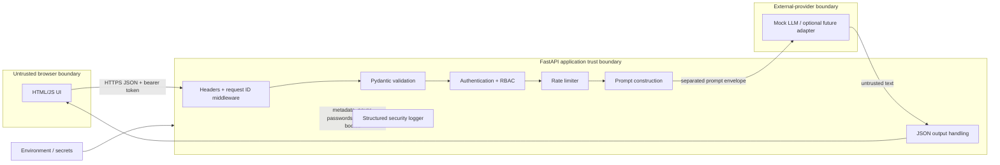

# Architecture

The system is deliberately one deployable service. This keeps security-critical flows traceable while preserving production-style layers.

## Components and decisions

- `app/main.py` is the composition root and reachable HTTP surface. Middleware adds request correlation and browser hardening headers.
- `app/auth.py` verifies expensive PBKDF2 hashes, creates short-lived HMAC-signed tokens, and checks roles server-side. This educational user store is intentionally replaceable.
- `app/rate_limit.py` bounds abuse in one process. It is not distributed and is bypassable by source-IP rotation on login.
- `app/service.py` separates fixed system text, application context, and user data in a typed envelope. Separation improves reasoning; it cannot make prompt injection impossible.
- `app/llm/provider.py` isolates model access. The deterministic mock is the only enabled implementation, so no external data transfer or paid account is required.
- The API serializes model output as JSON and the UI assigns `textContent`. No model-produced code, URLs, commands, HTML, or tool calls execute.

## External dependencies

FastAPI/Pydantic validate and serve HTTP; Uvicorn is the ASGI server. A reverse proxy must provide TLS and trusted-proxy configuration in production. The mock model is local. Logs leave the application trust boundary when a deployment collects standard output; collector access control and retention are deployment responsibilities.
